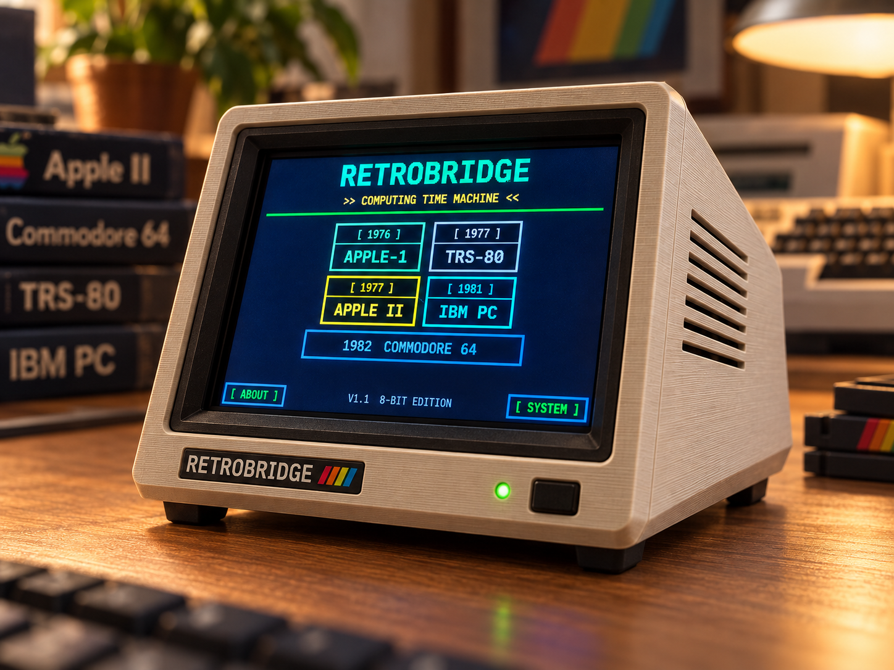
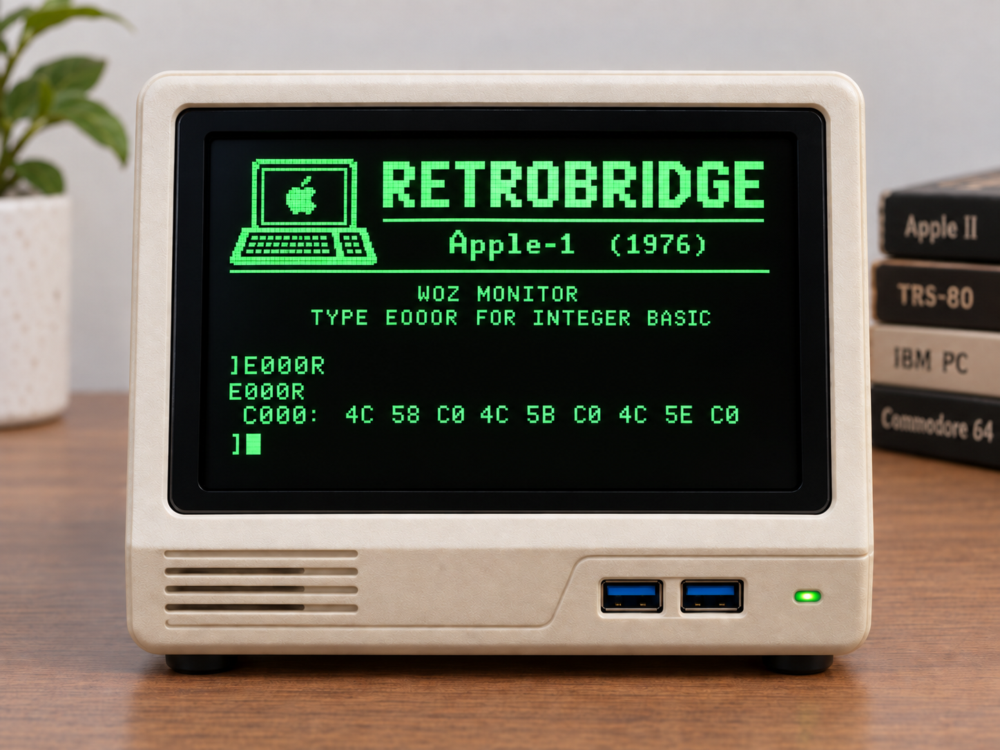
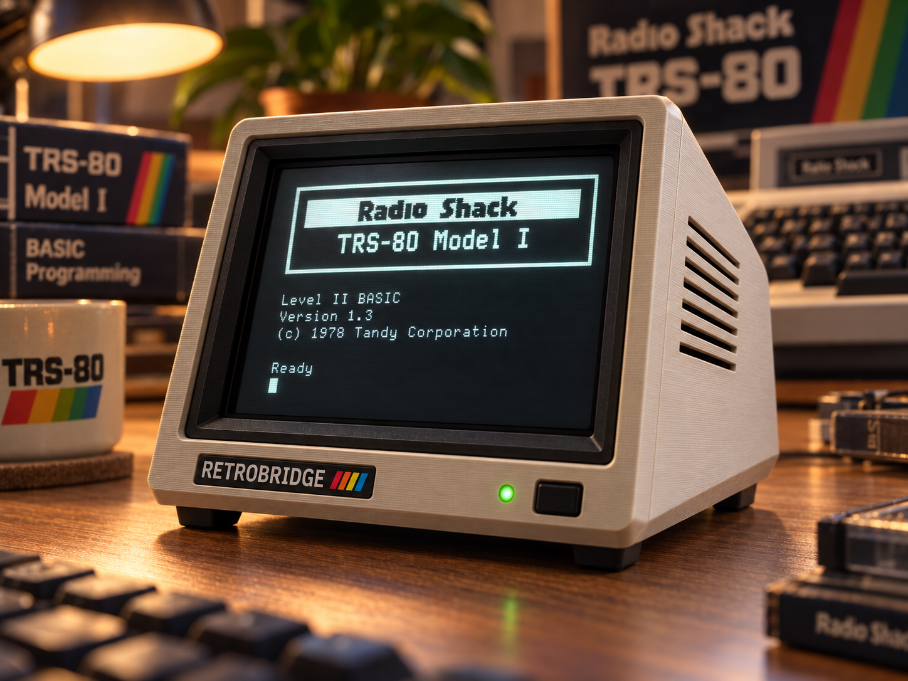
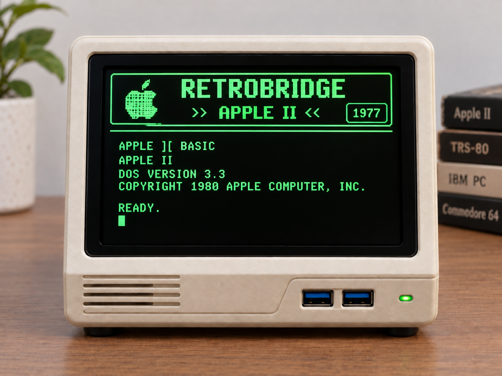
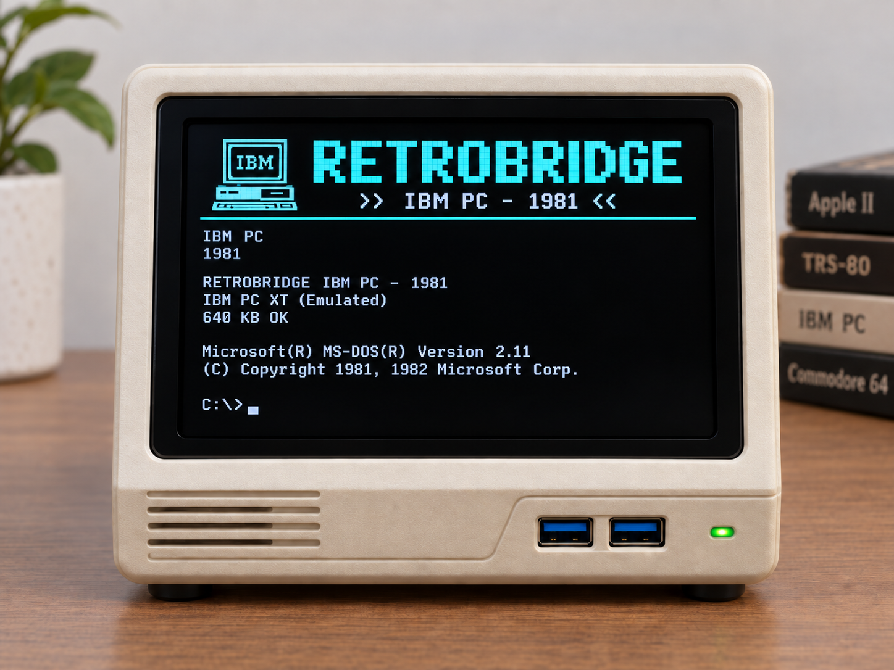
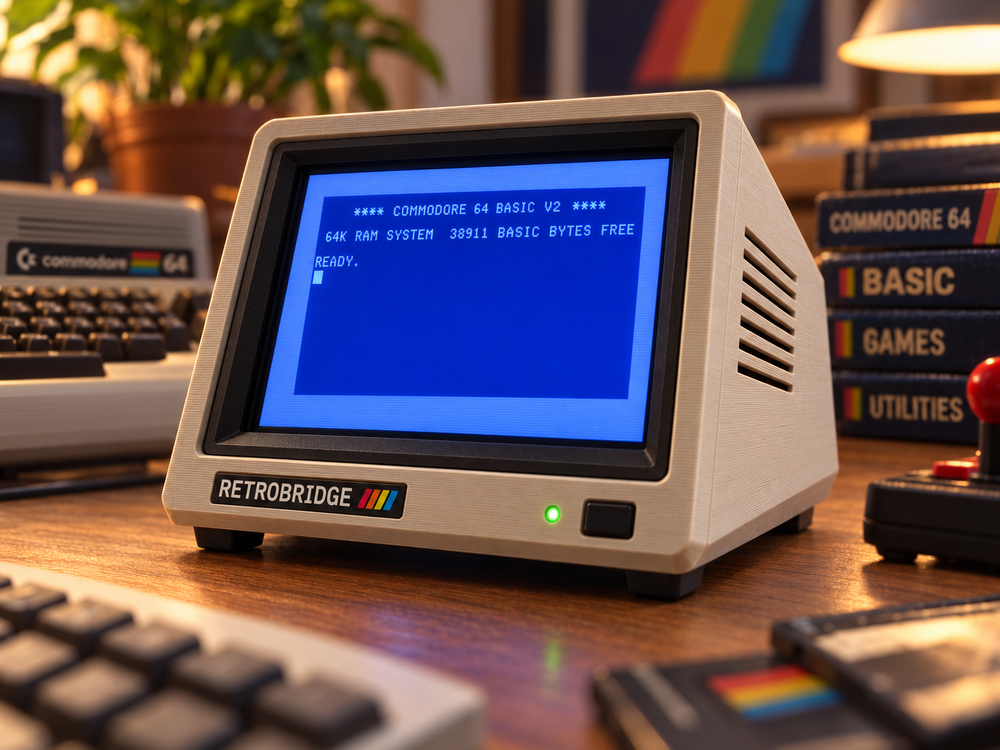
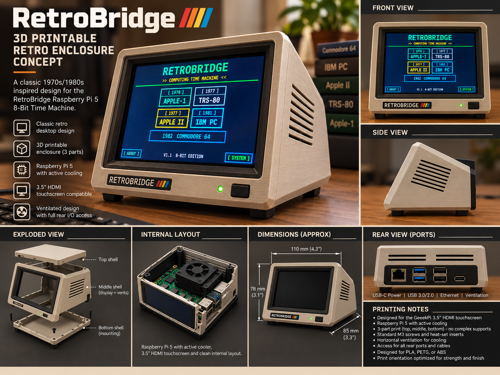

# RetroBridge



## Project links

- **GitHub repository:** https://github.com/retrobridge-jc/RetroBridge
- **Instructables build guide:** https://www.instructables.com/RetroBridge-Build-a-Raspberry-Pi-5-Computing-Time-/
- **Hackaday project:** `HACKADAY_URL_GOES_HERE`
- **V1.1 release:** https://github.com/retrobridge-jc/RetroBridge/releases/tag/v1.1

## Five Computers. Six Years. One Computing Time Machine.

RetroBridge is a Raspberry Pi 5 appliance that turns a 3.5-inch, 480x320 touchscreen into a hands-on tour through the formative years of personal computing.

| Year | System | Reference implementation |
|---|---|---|
| 1976 | Apple-1 | EWM (Emulated Woz Machine), obtained upstream |
| 1977 | TRS-80 Model I | Open Level-II-BASIC-compatible interpreter |
| 1977 | Apple II | EWM (Emulated Woz Machine) |
| 1981 | IBM PC | DOSBox |
| 1982 | Commodore 64 | VICE with Debian `open-roms` replacements |

Power it on and RetroBridge boots directly into a custom 8-bit Time Machine interface instead of presenting a Linux desktop.

> **Modern hardware. Historic computing.**

## Gallery

| Apple-1 | TRS-80 Model I |
|---|---|
|  |  |

| Apple II | IBM PC |
|---|---|
|  |  |

### Commodore 64



## Optional retro enclosure concept



The gallery uses a single period-inspired enclosure design so the project visuals, build concept, and system screenshots stay consistent.

**Important:** the enclosure shown above is a **3D-printable enclosure concept/design target**. It is not yet an engineering-validated STL/CAD package. Dimensions, port clearances, thermal behavior, fastener placement, print tolerances, and assembly details still need physical validation before printable files are published.

The validated V1.1 reference appliance currently uses the off-the-shelf GeeekPi/52Pi 3.5-inch touchscreen enclosure.

For the contest-focused overview, see [`HACKADAY_CONTEST_2026.md`](HACKADAY_CONTEST_2026.md).

## Why RetroBridge?

RetroBridge is not intended to be a generic emulator launcher. It is a purpose-built computing-history appliance with:

- a touch-first 480x320 interface;
- machine-specific 8-bit visual themes;
- direct boot into the Time Machine;
- historical context for every system;
- a program-library model;
- consistent launch/return behavior;
- maintenance and diagnostics controls;
- a documented whole-card recovery process; and
- explicit separation between original project code and third-party firmware/software.

## Hardware

The validated reference build uses:

- Raspberry Pi 5 Model B, 8 GB
- GeeekPi 3.5-inch 480x320 HDMI touchscreen enclosure
- approximately 32 GB microSD
- Raspberry Pi OS / Debian 13 Trixie
- USB keyboard
- Wi-Fi/Ethernet for maintenance

See [`docs/HARDWARE.md`](docs/HARDWARE.md).

## Installation

Start with [`docs/INSTALL.md`](docs/INSTALL.md).

For the validated Trixie display path, also see:

- [`docs/DISPLAY_TRIXIE.md`](docs/DISPLAY_TRIXIE.md)
- [`docs/AUTOSTART_TRIXIE.md`](docs/AUTOSTART_TRIXIE.md)
- [`docs/INSTALL_EWM.md`](docs/INSTALL_EWM.md)
- [`docs/DOSBOX_480X320.md`](docs/DOSBOX_480X320.md)

For a normal public install:

```bash
./install.sh
```

Then complete the EWM source-build steps and run:

```bash
./tools/check_components.sh
```

The private reference appliance was built under `/home/jc/retrobridge`, but the public package is portable. By default `install.sh` installs to `$HOME/retrobridge`; set `RETROBRIDGE_HOME` to choose another location.

## Maintenance escape hatch

Prevent RetroBridge from starting on the next boot:

```bash
touch /home/jc/retrobridge/system/maintenance
sudo reboot
```

Return to appliance mode:

```bash
rm -f /home/jc/retrobridge/system/maintenance
sudo reboot
```

## Recovery and reproducibility

The working V1.1 appliance was preserved as a full-card image and independently SHA-256 verified before and after gzip compression.

The private recovery image is **not included** because a full OS image can contain local account, SSH, network, and other machine-specific state.

RetroBridge V1.1 was also reproduced on a separate, fresh Debian 13 Trixie microSD using this public project plus third-party components obtained from their upstream sources.

Validated clean-build result:

- Apple-1: PASS
- TRS-80 Model I: PASS
- Apple II: PASS
- IBM PC: PASS
- Commodore 64: PASS
- 480x320 display: PASS
- touch: PASS
- boot-to-RetroBridge: PASS

See [`docs/RECOVERY.md`](docs/RECOVERY.md) and [`docs/RECOVERY_VALIDATION.md`](docs/RECOVERY_VALIDATION.md).

## Project status

**V1.1 - 8-Bit Edition**

All five target environments launch successfully on the validated Raspberry Pi 5 build.

## Publishing and licensing

Original RetroBridge project code and documentation are covered by [`LICENSE`](LICENSE).

Third-party emulators, ROMs, firmware, operating systems, games, disk images, and other software retain their own rights and licenses. Do not add proprietary ROMs or commercial software to a public fork without redistribution rights.

Read [`NOTICE.md`](NOTICE.md), [`LICENSES.md`](LICENSES.md), [`docs/LICENSING.md`](docs/LICENSING.md), and [`docs/THIRD_PARTY.md`](docs/THIRD_PARTY.md).

**RetroBridge is an integration platform, not a software archive.**

## Author

John Chirillo
